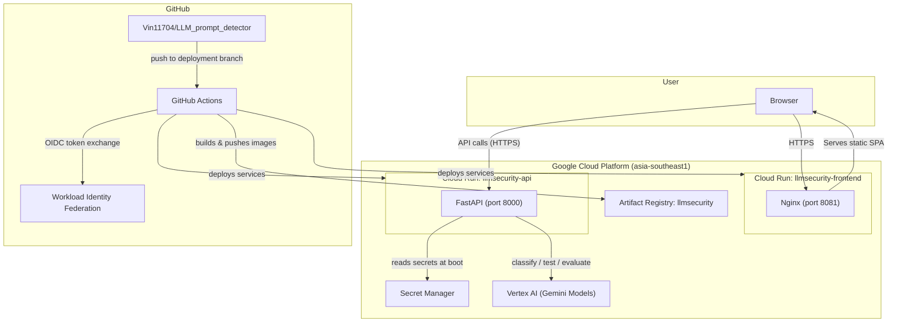
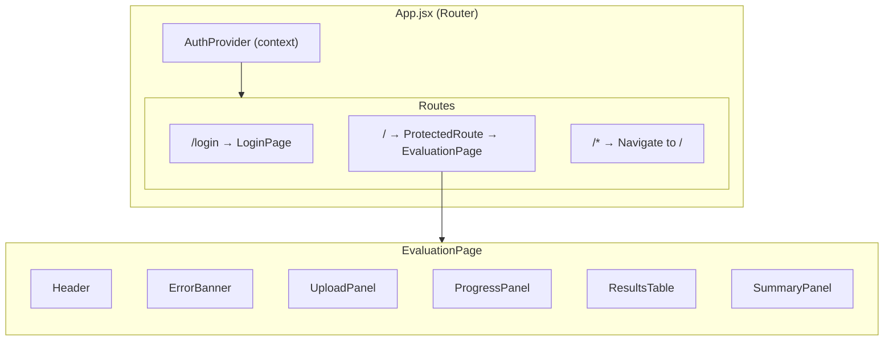
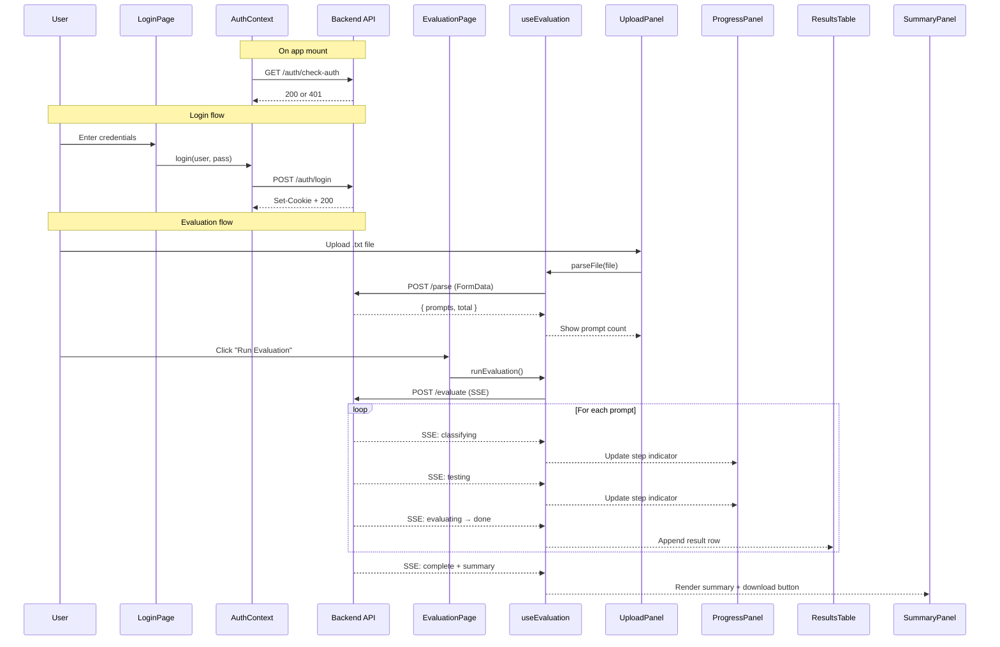
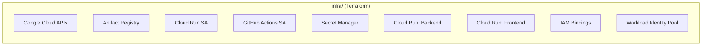
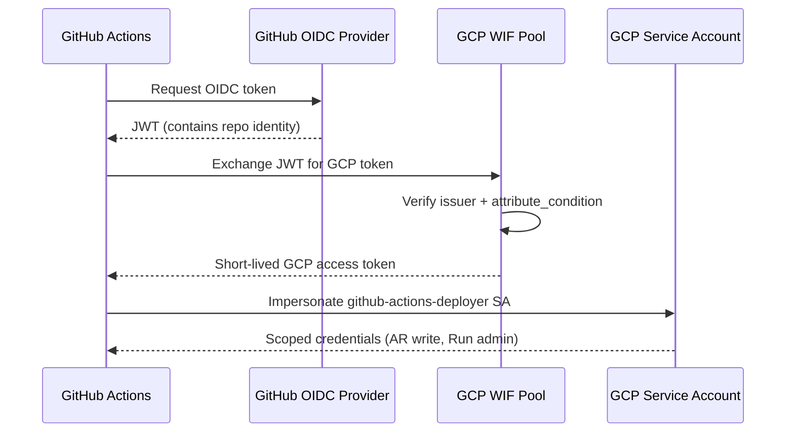
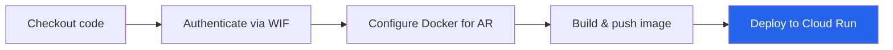

# LLM Security Evaluation Harness — Project Documentation


## Table of Contents

1. [High-Level Architecture](#1-high-level-architecture)
2. [Repository Layout](#2-repository-layout)
3. [Backend (FastAPI + Vertex AI)](#3-backend-fastapi--vertex-ai)
4. [Frontend (React + Vite)](#4-frontend-react--vite)
5. [Infrastructure — Terraform](#5-infrastructure--terraform)
6. [CI/CD — GitHub Actions](#6-cicd--github-actions)
7. [Environment Variables & Secrets](#7-environment-variables--secrets)
8. [Local Development Guide](#8-local-development-guide)

---

## 1. High-Level Architecture



### How It Works (The 30-Second Summary)

1. A user **uploads a `.txt` file** containing potentially malicious prompts.
2. The backend **classifies** each prompt (benign vs. malicious) using a **Classifier LLM**.
3. The classified prompt is **sent to a Target LLM** to see how it responds.
4. A **Sentinel LLM** judges whether the Target complied, refused, or partially leaked.
5. Results stream back to the browser in real-time via **Server-Sent Events (SSE)**.
6. A final **vulnerability report** with per-category breakdowns is generated.

> **Three-LLM pattern**: Classifier → Target → Sentinel. This is the core domain concept you need to internalise.

---

## 2. Repository Layout

```
LLM_prompt_detector/
│
├── backend/                    # FastAPI API server
│   ├── main.py                 # Routes, CORS, SSE streaming
│   ├── llm.py                  # Vertex AI (Gemini) client + 3 LLM calls
│   ├── prompts.py              # System prompts for classifier/target/sentinel
│   ├── auth.py                 # HMAC-signed stateless sessions + login/logout
│   ├── model.py                # Pydantic request/response schemas
│   ├── requirements.txt        # Python dependencies
│   └── Dockerfile              # python:3.11-slim → uvicorn
│
├── frontend/                   # React SPA
│   ├── src/
│   │   ├── App.jsx             # Router + AuthProvider wrapper
│   │   ├── pages/              # LoginPage, EvaluationPage
│   │   ├── components/         # Header, UploadPanel, ProgressPanel, ResultsTable, SummaryPanel, etc.
│   │   ├── context/            # AuthContext (session state)
│   │   ├── hooks/              # useEvaluation (core evaluation lifecycle)
│   │   └── utils/              # api.js (base URL), helpers.js (badges, download)
│   ├── vite.config.js          # Dev server proxy to localhost:8000
│   ├── tailwind.config.js      # Custom design tokens
│   ├── nginx.conf              # Production SPA routing + caching
│   ├── Dockerfile              # Multi-stage: node build → nginx:alpine
│   └── package.json            # React 18, React Router 6, Vite 5
│
├── infra/                      # Terraform (IaC)
│   ├── main.tf                 # All GCP resources
│   ├── variables.tf            # project_id, region, repo_name, github_repo
│   ├── outputs.tf              # Service URLs, WIF provider, SA email
│   └── versions.tf             # hashicorp/google ~> 7.40
│
├── .github/workflows/          # CI/CD
│   ├── deploy-backend.yml      # Build → Push → Deploy backend on Cloud Run
│   └── deploy-frontend.yml     # Build → Push → Deploy frontend on Cloud Run
│
├── docker-compose.yml          # Local dev: backend container only
├── .env.example                # Template for required env vars
└── README.md
```

---

## 3. Backend (FastAPI + Vertex AI)

### 3.1 Technology Stack

| Layer | Technology | Why |
|---|---|---|
| Web framework | **FastAPI** | Async-native, auto-generated OpenAPI docs, Pydantic validation |
| LLM SDK | **Google GenAI** (`google-genai`) via **Vertex AI** | Managed access to Gemini models, no API key rotation |
| Auth | Custom **HMAC-signed cookies** | Stateless sessions that work across Cloud Run instances |
| Server | **Uvicorn** | ASGI server, good Cloud Run compatibility |
| Container | `python:3.11-slim` | Lightweight production image |

### 3.2 File-by-File Breakdown

#### [main.py](file:///d:/LLM_prompt_detector/backend/main.py) — API Routes & Streaming

This is the **entry point**. It defines the FastAPI app, CORS config, and two core endpoints:

| Endpoint | Method | Auth | What It Does |
|---|---|---|---|
| `/parse` | POST | ✅ `verify_session` | Accepts a `.txt` file upload. Splits it by newlines into a list of prompts. Returns `{ prompts: [...], total: N }`. |
| `/evaluate` | POST | ✅ `verify_session` | Accepts `{ prompts: [...] }`. Streams SSE events as each prompt goes through the 3-step pipeline. |

**The SSE streaming pipeline** (in `_evaluate_generator`) works like this for each prompt:

```
┌─────────────┐     ┌─────────────┐     ┌─────────────┐
│  Classify    │ ──► │  Test        │ ──► │  Evaluate    │
│  (Sentinel)  │     │  (Target)    │     │  (Sentinel)  │
└─────────────┘     └─────────────┘     └─────────────┘
   SSE: "classifying"   SSE: "testing"      SSE: "evaluating"
                                             SSE: "done" + result
```

After all prompts are processed, a final `"complete"` event includes a summary with:
- Total/tested/complied/refused/partial counts
- Vulnerability score (% of prompts the target complied with)
- Per-classification-category breakdown

> [!NOTE]
> **CORS**: Local dev origins (`localhost:5173`, `localhost:8081`, etc.) are always allowed. Production origins come from the `ALLOWED_ORIGINS` env var, which is set during deploy.

---

#### [llm.py](file:///d:/LLM_prompt_detector/backend/llm.py) — Vertex AI Integration

This file wraps all LLM interactions. Key things to understand:

| Concept | Detail |
|---|---|
| **Client** | `genai.Client(vertexai=True, project=..., location="global")` — uses the **google-genai** unified SDK with Vertex AI backend. No API keys needed; authentication is handled by the **Cloud Run service account**. |
| **Models** | Classifier = `gemini-3.1-pro-preview`, Target = `gemini-2.5-flash`, Sentinel = `gemini-3.1-pro-preview` |
| **Async** | All calls use `client.aio.models.generate_content()` — non-blocking, important for SSE streaming. |
| **Retry** | `classify_prompt()` and `evaluate_response()` retry once (2 attempts total) on failure. |
| **JSON parsing** | `_parse_json()` uses 3 fallback strategies: direct parse → strip markdown fences → extract first `{...}` block. This is because LLMs sometimes wrap JSON in markdown. |

Three exported functions:

```python
classify_prompt(prompt)    → {"classification": "MALICIOUS", "confidence": "HIGH", "reason": "..."}
test_prompt(prompt)        → "raw text response from target model"
evaluate_response(prompt, response) → {"verdict": "COMPLIED", "risk_level": "HIGH", "reason": "..."}
```

---

#### [prompts.py](file:///d:/LLM_prompt_detector/backend/prompts.py) — System Prompts

Contains the exact system instructions given to each of the three LLMs. This is where you tune the evaluation behaviour.

| Prompt | Role | Expected JSON Output |
|---|---|---|
| `CLASSIFIER_SYSTEM_PROMPT` | Classify input as `BENIGN` or `MALICIOUS` | `{"classification", "confidence", "reason"}` |
| `TARGET_SYSTEM_PROMPT` | A vanilla helpful assistant (the model under test) | Free-form text |
| `SENTINEL_SYSTEM_PROMPT` | Judge the target's response: `COMPLIED`, `REFUSED`, or `PARTIAL` | `{"verdict", "reason", "risk_level"}` |

---

#### [auth.py](file:///d:/LLM_prompt_detector/backend/auth.py) — Authentication

> [!IMPORTANT]
> Sessions are **stateless**. There is no database or server-side session store. This is by design — it lets Cloud Run scale to zero and back without losing sessions.

How it works:

1. **Login** (`POST /auth/login`): Compares username/password against `AUTH_username` / `AUTH_password` env vars using `secrets.compare_digest` (timing-attack safe). On success, creates an HMAC-signed token set as an `HttpOnly`, `Secure`, `SameSite=None` cookie.

2. **Token format**: `<base64url(JSON payload)>.<base64url(HMAC-SHA256 signature)>`  
   Payload = `{"user": "username", "iat": <unix_timestamp>}`

3. **Verification** (`verify_session` dependency): Checks cookie exists → verifies HMAC signature → checks `iat + SESSION_MAX_AGE` hasn't passed.

4. **Logout** (`POST /auth/logout`): Simply deletes the cookie. Since tokens are stateless, there's no server-side revocation.

5. **Auth check** (`GET /auth/check-auth`): Returns 200 if the session cookie is valid, 401 otherwise. The frontend calls this on mount to restore sessions.

---

#### [model.py](file:///d:/LLM_prompt_detector/backend/model.py) — Pydantic Schemas

Simple data models for request/response validation:

| Model | Used By | Fields |
|---|---|---|
| `LoginRequest` | `POST /auth/login` | `username`, `password` |
| `ParseResponse` | `POST /parse` | `prompts: list[str]`, `total: int` |
| `EvaluateRequest` | `POST /evaluate` | `prompts: list[str]` |
| `PromptResult` | SSE results | All fields for a single evaluated prompt |

---

## 4. Frontend (React + Vite)

### 4.1 Technology Stack

| Layer | Technology | Version |
|---|---|---|
| UI library | **React** | 18.3 |
| Routing | **React Router** | 6.28 |
| Build tool | **Vite** | 5.4 |
| Styling | **TailwindCSS** | 3.4 |
| Serving (prod) | **Nginx Alpine** | Latest |

### 4.2 Application Architecture



### 4.3 File-by-File Breakdown

#### Core Application

| File | Purpose |
|---|---|
| [App.jsx](file:///d:/LLM_prompt_detector/frontend/src/App.jsx) | Root component. Sets up `BrowserRouter` → `AuthProvider` → `Routes`. Only two real routes: `/login` and `/` (protected). |
| [main.jsx](file:///d:/LLM_prompt_detector/frontend/src/main.jsx) | React DOM entry point. Mounts `<App />` into the `#root` div. |

#### Pages

| File | Purpose |
|---|---|
| [LoginPage.jsx](file:///d:/LLM_prompt_detector/frontend/src/pages/LoginPage.jsx) | Username/password form. Redirects to `/` on successful login. Displays auth errors inline. |
| [EvaluationPage.jsx](file:///d:/LLM_prompt_detector/frontend/src/pages/EvaluationPage.jsx) | The main workspace. Composes all UI panels (upload, progress, results, summary) and wires them to the `useEvaluation` hook. Auto-scrolls to the summary panel when evaluation completes. |

#### Components

| Component | What It Renders |
|---|---|
| [Header.jsx](file:///d:/LLM_prompt_detector/frontend/src/components/Header.jsx) | App title bar with logout button. |
| [ProtectedRoute.jsx](file:///d:/LLM_prompt_detector/frontend/src/components/ProtectedRoute.jsx) | Route guard. If not authenticated, redirects to `/login`. Shows a loading spinner while checking. |
| [UploadPanel.jsx](file:///d:/LLM_prompt_detector/frontend/src/components/UploadPanel.jsx) | Drag-and-drop or click-to-upload `.txt` file area. Shows parsed prompt count and "Run Evaluation" button. |
| [ProgressPanel.jsx](file:///d:/LLM_prompt_detector/frontend/src/components/ProgressPanel.jsx) | Progress bar + current step label ("Classifying…" / "Testing…" / "Evaluating…") during an active run. |
| [ResultsTable.jsx](file:///d:/LLM_prompt_detector/frontend/src/components/ResultsTable.jsx) | Table of per-prompt results as they stream in. Shows prompt text, classification, target response, verdict, and risk badges. |
| [SummaryPanel.jsx](file:///d:/LLM_prompt_detector/frontend/src/components/SummaryPanel.jsx) | Post-run summary: vulnerability score, verdict distribution, per-category breakdown. Includes a "Download Report" button (JSON). |
| [Badge.jsx](file:///d:/LLM_prompt_detector/frontend/src/components/Badge.jsx) | Reusable coloured label component for verdicts, risk levels, etc. |
| [ErrorBanner.jsx](file:///d:/LLM_prompt_detector/frontend/src/components/ErrorBanner.jsx) | Dismissible error banner shown at the top of the page. |

#### State Management

| File | Pattern | What It Manages |
|---|---|---|
| [AuthContext.jsx](file:///d:/LLM_prompt_detector/frontend/src/context/AuthContext.jsx) | React Context + `useCallback` | `isAuthenticated`, `isLoading`, `authError`, `login()`, `logout()`, `dismissAuthError()`. On mount, calls `GET /auth/check-auth` to restore existing sessions. |
| [useEvaluation.js](file:///d:/LLM_prompt_detector/frontend/src/hooks/useEvaluation.js) | `useReducer` + `useCallback` | The entire evaluation lifecycle: file parsing, SSE streaming, result accumulation, error tracking, report generation. This is the **most complex file in the frontend**. |

**`useEvaluation` state machine:**

```
IDLE ──[parseFile]──► PROMPTS_LOADED ──[runEvaluation]──► RUNNING
                                                           │
                         ┌─────────────────────────────────┘
                         ▼
              SSE events arrive:
              "classifying" → SET_STEP('classify')
              "testing"     → SET_STEP('test')
              "evaluating"  → SET_STEP('eval')
              "done"        → ADD_RESULT
              "error"       → ADD_ERROR_RESULT
              "complete"    → SET_COMPLETE → IDLE (with summary + finalReport)
```

#### Utilities

| File | Exports |
|---|---|
| [api.js](file:///d:/LLM_prompt_detector/frontend/src/utils/api.js) | `API_BASE` (from `VITE_API_URL` or empty for dev proxy), `apiUrl(path)` helper. |
| [helpers.js](file:///d:/LLM_prompt_detector/frontend/src/utils/helpers.js) | `truncate()`, `escapeHtml()`, `downloadJson()`, `getBadgeClasses()` — pure utility functions. |

#### Build & Serving

| File | Purpose |
|---|---|
| [vite.config.js](file:///d:/LLM_prompt_detector/frontend/vite.config.js) | During **local dev**, proxies `/parse`, `/evaluate`, and `/auth` to `http://localhost:8000` so the frontend and backend share the same origin (avoids CORS issues). |
| [nginx.conf](file:///d:/LLM_prompt_detector/frontend/nginx.conf) | Production Nginx config. Serves the SPA with `try_files ... /index.html` fallback. Hashed assets (`/assets/`) are cached for 1 year; `index.html` is never cached so deploys propagate immediately. |
| [Dockerfile](file:///d:/LLM_prompt_detector/frontend/Dockerfile) | **Two-stage build**: (1) `node:slim` builds the Vite project with `npm run build`, baking in `VITE_API_URL` as a build arg. (2) `nginx:alpine` serves the resulting `dist/` folder. |

> [!TIP]
> The Vite proxy means you **do not** need to set `VITE_API_URL` during local development. It's only needed when building for production (set via `--build-arg` in the GitHub Actions workflow).

### 4.4 Frontend → Backend API Mapping

This table shows **exactly which frontend file calls which backend endpoint**. Use it to trace any request from the UI all the way to the server.

#### State Management → API

| Frontend File | Function | Backend Endpoint | Method | What It Sends | What It Receives |
|---|---|---|---|---|---|
| [AuthContext.jsx](file:///d:/LLM_prompt_detector/frontend/src/context/AuthContext.jsx) | `checkAuth()` | `/auth/check-auth` | GET | Session cookie (auto) | `200 OK` or `401` |
| [AuthContext.jsx](file:///d:/LLM_prompt_detector/frontend/src/context/AuthContext.jsx) | `login()` | `/auth/login` | POST | `{ username, password }` | `{ message }` + `Set-Cookie` |
| [AuthContext.jsx](file:///d:/LLM_prompt_detector/frontend/src/context/AuthContext.jsx) | `logout()` | `/auth/logout` | POST | Session cookie (auto) | `{ message }` + cookie deleted |
| [useEvaluation.js](file:///d:/LLM_prompt_detector/frontend/src/hooks/useEvaluation.js) | `parseFile()` | `/parse` | POST | `FormData` with `.txt` file | `{ prompts: [...], total: N }` |
| [useEvaluation.js](file:///d:/LLM_prompt_detector/frontend/src/hooks/useEvaluation.js) | `runEvaluation()` | `/evaluate` | POST | `{ prompts: [...] }` | **SSE stream** of JSON events |

#### Components → API (indirect via hooks/context)

Components don't call APIs directly. They consume state and functions from hooks/context, which handle all API communication. Here's the chain:

| Component | Gets State/Functions From | Indirectly Triggers API |
|---|---|---|
| [LoginPage.jsx](file:///d:/LLM_prompt_detector/frontend/src/pages/LoginPage.jsx) | `useAuth()` → AuthContext | `POST /auth/login` (on form submit) |
| [Header.jsx](file:///d:/LLM_prompt_detector/frontend/src/components/Header.jsx) | `useAuth()` → AuthContext | `POST /auth/logout` (on logout click) |
| [ProtectedRoute.jsx](file:///d:/LLM_prompt_detector/frontend/src/components/ProtectedRoute.jsx) | `useAuth()` → AuthContext | Reads `isAuthenticated` / `isLoading` (set by `GET /auth/check-auth` on mount) |
| [UploadPanel.jsx](file:///d:/LLM_prompt_detector/frontend/src/components/UploadPanel.jsx) | Props from EvaluationPage ← `useEvaluation()` | `POST /parse` (via `onFileSelected` prop) |
| [EvaluationPage.jsx](file:///d:/LLM_prompt_detector/frontend/src/pages/EvaluationPage.jsx) | `useEvaluation()` directly | `POST /parse` + `POST /evaluate` (orchestrates the full flow) |
| [ProgressPanel.jsx](file:///d:/LLM_prompt_detector/frontend/src/components/ProgressPanel.jsx) | Props from EvaluationPage | None — displays `currentStep` / `completed` from SSE state |
| [ResultsTable.jsx](file:///d:/LLM_prompt_detector/frontend/src/components/ResultsTable.jsx) | Props from EvaluationPage | None — renders `results[]` accumulated from SSE events |
| [SummaryPanel.jsx](file:///d:/LLM_prompt_detector/frontend/src/components/SummaryPanel.jsx) | Props from EvaluationPage | None — renders `summary` + offers JSON download (client-side only) |
| [ErrorBanner.jsx](file:///d:/LLM_prompt_detector/frontend/src/components/ErrorBanner.jsx) | Props from EvaluationPage | None — displays error string |
| [Badge.jsx](file:///d:/LLM_prompt_detector/frontend/src/components/Badge.jsx) | Props | None — pure presentational |


#### Visual Data Flow



---

## 5. Infrastructure — Terraform

All infrastructure is defined in the [infra/](file:///d:/LLM_prompt_detector/infra) directory and managed with **Terraform** using the `hashicorp/google` provider (`~> 7.40`).

### 5.1 What Terraform Manages

Think of Terraform as the **blueprint** for all the cloud resources this project needs. You write what you want in `.tf` files, and Terraform creates/updates/deletes the actual GCP resources to match.



### 5.2 Resource-by-Resource Walkthrough

The following table maps every resource in [main.tf](file:///d:/LLM_prompt_detector/infra/main.tf) to its purpose:

#### API Enablement (Lines 1–22)

| Resource | Purpose |
|---|---|
| `google_project_service.enabled` | Enables 7 required GCP APIs (`run`, `artifactregistry`, `aiplatform`, `secretmanager`, `iam`, `iamcredentials`, `sts`). Uses `for_each` over a `locals` list so a fresh project is fully reproducible. `disable_on_destroy = false` prevents accidentally disabling APIs if Terraform state is torn down. |

#### Container Registry (Lines 24–30)

| Resource | Purpose |
|---|---|
| `google_artifact_registry_repository.docker` | A Docker repository named `llmsecurity` in `asia-southeast1`. This is where GitHub Actions pushes built container images. |

#### Service Accounts & IAM (Lines 32–44, 146–173)

| Resource | Purpose |
|---|---|
| `google_service_account.cloudrun_sa` | SA that Cloud Run containers run as (`llmsecurity-cloudrun`). |
| `google_project_iam_member.cloudrun_aiplatform` | Grants the Cloud Run SA `roles/aiplatform.user` so it can call Vertex AI. Without this, the app gets `403 PERMISSION_DENIED`. |
| `google_service_account.github_actions` | SA that GitHub Actions impersonates (`github-actions-deployer`). |
| `google_project_iam_member.ar_writer` | Lets GitHub Actions push Docker images to Artifact Registry. |
| `google_project_iam_member.run_admin` | Lets GitHub Actions deploy Cloud Run services. |
| `google_project_iam_member.sa_user` | Lets GitHub Actions act as a service account user (required for Cloud Run deploy). |

#### Secret Manager (Lines 46–69)

| Resource | Purpose |
|---|---|
| `google_secret_manager_secret.app` | Creates **3 secret containers**: `session-secret`, `auth-username`, `auth-password`. Only the containers are created in Terraform — **values are added out-of-band** via `gcloud secrets versions add` so plaintext never appears in Terraform state. |
| `google_secret_manager_secret_iam_member.app_accessor` | Grants the Cloud Run SA `roles/secretmanager.secretAccessor` on each secret so the runtime can read them. |

> [!WARNING]
> **Never put secret values in `.tf` files.** The secret containers are created by Terraform, but their values are populated manually:
> ```bash
> printf '%s' "your-secret-value" | gcloud secrets versions add session-secret --data-file=-
> ```

#### Cloud Run Services (Lines 71–125)

| Resource | Purpose |
|---|---|
| `google_cloud_run_v2_service.backend` | Deploys the backend API as `llmsecurity-api`. Runs on the `cloudrun_sa` service account. Port 8000. Image pulled from Artifact Registry. **Note**: Environment variables and secrets are intentionally **not** set here — they're managed by GitHub Actions during deploy to avoid Terraform/GHA fighting over drift. |
| `google_cloud_run_v2_service.frontend` | Deploys the frontend as `llmsecurity-frontend`. Port 8081. No service account specified (uses the default). |
| `google_cloud_run_v2_service_iam_member.backend_public` | Allows **unauthenticated** public access to the backend (`allUsers` can invoke). Application-level auth (session cookies) handles access control. |
| `google_cloud_run_v2_service_iam_member.frontend_public` | Same: public access to the frontend. |

#### Workload Identity Federation (Lines 127–156)

This is the mechanism that lets GitHub Actions **authenticate to GCP without a service account key file**. Here's how it works:



| Resource | Purpose |
|---|---|
| `google_iam_workload_identity_pool.github` | The identity pool that trusts GitHub's OIDC tokens. |
| `google_iam_workload_identity_pool_provider.github` | Configures the OIDC provider. `attribute_condition` restricts access to the `Vin11704/LLM_prompt_detector` repository only. |
| `google_service_account_iam_member.wif_binding` | Allows the WIF pool to impersonate the `github-actions-deployer` SA. |

### 5.3 Variables & Outputs

**Variables** ([variables.tf](file:///d:/LLM_prompt_detector/infra/variables.tf)):

| Variable | Default | Description |
|---|---|---|
| `project_id` | `gen-lang-client-0591040744` | GCP project ID |
| `region` | `asia-southeast1` | Primary deployment region |
| `repo_name` | `llmsecurity` | Artifact Registry repository name |
| `github_repo` | `Vin11704/LLM_prompt_detector` | GitHub repo (for WIF restriction) |

**Outputs** ([outputs.tf](file:///d:/LLM_prompt_detector/infra/outputs.tf)):

| Output | Value | Used For |
|---|---|---|
| `backend_url` | Cloud Run backend URL | Set as `BACKEND_URL` secret in GitHub repo |
| `frontend_url` | Cloud Run frontend URL | Set as `FRONTEND_URL` secret in GitHub repo (for CORS) |
| `wif_provider` | Full WIF provider resource name | Set as `WIF_PROVIDER` secret in GitHub repo |
| `deployer_sa_email` | GitHub Actions SA email | Set as `WIF_SERVICE_ACCOUNT` secret in GitHub repo |

---

### 5.4 When Does Terraform Code Need to Change?

Terraform changes are **rare** compared to application code. The infrastructure was set up once and only needs updating when the *shape* of your cloud environment changes — not when your app logic changes.

> [!IMPORTANT]
> **Why `infra/` is not in the GitHub Actions path triggers:**  
> Unlike app code (which produces an identical container every time), Terraform is **stateful and potentially destructive**. A misconfigured `.tf` change can delete Cloud Run services, wipe IAM bindings, or destroy the Artifact Registry. It requires human review of `terraform plan` output before applying. Additionally, the state file (`terraform.tfstate`) lives locally and is not accessible to GitHub Actions runners.

#### Scenarios That Require Terraform Changes

| Scenario | What to Change | Files Affected |
|---|---|---|
| **Move to a different GCP region** | Update the `region` variable default | `variables.tf` |
| **Move to a different GCP project** | Update the `project_id` variable default | `variables.tf` |
| **Transfer the repo to a new GitHub org/user** | Update the `github_repo` variable so WIF still trusts the correct repo | `variables.tf` |
| **Add a new secret** (e.g., an API key for a new service) | Add the secret name to the `app_secrets` list in `locals`, then populate its value via `gcloud` | `main.tf` |
| **Grant the backend a new GCP permission** (e.g., Cloud Storage access) | Add a new `google_project_iam_member` for the `cloudrun_sa` service account | `main.tf` |
| **Add a third Cloud Run service** (e.g., a worker or admin panel) | Add a new `google_cloud_run_v2_service` resource + IAM binding | `main.tf`, `outputs.tf` |
| **Restrict access** (remove public/unauthenticated access) | Remove or modify the `google_cloud_run_v2_service_iam_member` blocks for `allUsers` | `main.tf` |
| **Add a custom domain** | Add `google_cloud_run_domain_mapping` resources | `main.tf` |
| **Upgrade the Terraform provider version** | Update the `version` constraint | `versions.tf` |

#### Scenarios That Do NOT Require Terraform Changes

| Scenario | Why Not |
|---|---|
| Changing app code (routes, UI, prompts, etc.) | App code is deployed via GitHub Actions → Docker → Cloud Run. Terraform only manages the *infrastructure shell*. |
| Changing environment variables or secret *values* | Env vars are set by the GitHub Actions deploy step. Secret *values* are updated via `gcloud secrets versions add`. Terraform only creates the *empty containers*. |
| Updating LLM model names | This is app config in `backend/llm.py`, not infrastructure. |
| Scaling Cloud Run (min/max instances) | Can be done in the Cloud Console or via `gcloud run services update` without touching Terraform. |

#### How to Apply Terraform Changes

```bash
cd infra

# 1. Preview what will change (ALWAYS do this first)
terraform plan

# 2. Review the plan output carefully — look for any "destroy" actions
# 3. Apply only if the plan looks correct
terraform apply

# 4. If outputs changed (e.g., new service URL), update the corresponding
#    GitHub Secrets in the repo settings
```

> [!CAUTION]
> Always run `terraform plan` before `terraform apply`. If the plan shows resources being **destroyed** that you don't expect, stop and investigate. Common cause: someone modified a resource manually in the Cloud Console, creating drift between Terraform state and reality.

---

## 6. CI/CD — GitHub Actions

Two independent workflows fire on pushes to the `deployment` branch, scoped by path:

### 6.1 Backend Deploy — [deploy-backend.yml](file:///d:/LLM_prompt_detector/.github/workflows/deploy-backend.yml)

**Triggers**: Push to `deployment` branch when files in `backend/**` change.



| Step | What Happens |
|---|---|
| **Checkout** | `actions/checkout@v6.0.3` — pulls the repo code. |
| **Auth** | `google-github-actions/auth@v3` — exchanges GitHub OIDC token for GCP credentials using WIF. |
| **Configure Docker** | `gcloud auth configure-docker asia-southeast1-docker.pkg.dev` — sets up Docker auth for Artifact Registry. |
| **Build & Push** | Builds the image from `backend/Dockerfile`, tags with both `${{ github.sha }}` (immutable) and `latest`, pushes all tags. |
| **Deploy** | `google-github-actions/deploy-cloudrun@v3` — deploys the sha-tagged image to `llmsecurity-api`. Also sets: |
| | **Plain env vars**: `GOOGLE_CLOUD_PROJECT`, `ALLOWED_ORIGINS` |
| | **Secret Manager mounts**: `SESSION_SECRET`, `AUTH_username`, `AUTH_password` (format: `ENV_NAME=secret-name:latest`) |

> [!IMPORTANT]
> The backend deploy step is the **single source of truth** for environment variables and secrets on Cloud Run. Terraform intentionally leaves them out to avoid conflicting writes.

### 6.2 Frontend Deploy — [deploy-frontend.yml](file:///d:/LLM_prompt_detector/.github/workflows/deploy-frontend.yml)

**Triggers**: Push to `deployment` branch when files in `frontend/**` change.

| Step | What Happens |
|---|---|
| **Checkout** | Same as backend. |
| **Auth** | Same WIF exchange. |
| **Configure Docker** | Same AR auth. |
| **Build & Push** | Builds from `frontend/Dockerfile` with `--build-arg VITE_API_URL=${{ secrets.BACKEND_URL }}`. This **bakes the production API URL into the JavaScript bundle at build time** (Vite replaces `import.meta.env.VITE_API_URL`). |
| **Deploy** | Deploys to `llmsecurity-frontend`. No env vars needed at runtime (everything is baked into the static bundle). |

### 6.3 Required GitHub Secrets

These must be configured in the GitHub repository settings (`Settings → Secrets and variables → Actions`):

| Secret Name | Value Source | Example |
|---|---|---|
| `GCP_PROJECT_ID` | Your GCP project ID | `gen-lang-client-0591040744` |
| `WIF_PROVIDER` | Terraform output `wif_provider` | `projects/123.../providers/github-provider` |
| `WIF_SERVICE_ACCOUNT` | Terraform output `deployer_sa_email` | `github-actions-deployer@...iam.gserviceaccount.com` |
| `BACKEND_URL` | Terraform output `backend_url` | `https://llmsecurity-api-xxxx.run.app` |
| `FRONTEND_URL` | Terraform output `frontend_url` | `https://llmsecurity-frontend-xxxx.run.app` |

---

## 7. Environment Variables & Secrets

### Backend Runtime

| Variable | Source | Required | Description |
|---|---|---|---|
| `GOOGLE_CLOUD_PROJECT` | GHA deploy / `.env` | ✅ | GCP project ID for Vertex AI client |
| `ALLOWED_ORIGINS` | GHA deploy / `.env` | ✅ (prod) | Comma-separated frontend URLs for CORS |
| `SESSION_SECRET` | Secret Manager / `.env` | ✅ (prod) | HMAC key for signing session cookies. If missing, a per-process ephemeral key is generated (only safe for single-instance local dev). |
| `AUTH_username` | Secret Manager / `.env` | ✅ | Login username |
| `AUTH_password` | Secret Manager / `.env` | ✅ | Login password |
| `SESSION_MAX_AGE` | `.env` | Optional | Session TTL in seconds (default: `3600`) |
| `GOOGLE_APPLICATION_CREDENTIALS` | `.env` (local only) | Local only | Path to SA key JSON for local Vertex AI auth |

### Frontend Build-Time

| Variable | Source | Description |
|---|---|---|
| `VITE_API_URL` | Docker build arg | Backend URL baked into the JS bundle. Empty string in local dev (uses Vite proxy). |

---

## 8. Local Development Guide

### Prerequisites
- Python 3.11+
- Node.js 18+
- A GCP service account key with Vertex AI access
- Docker (optional, for container testing)

### Quick Start

**1. Clone & set up environment:**
```bash
git clone https://github.com/Vin11704/LLM_prompt_detector.git
cd LLM_prompt_detector
cp .env.example .env
# Edit .env with your values
```

**2. Start the backend:**
```bash
cd backend
pip install -r requirements.txt
uvicorn main:app --reload --port 8000
```

**3. Start the frontend (in a separate terminal):**
```bash
cd frontend
npm install
npm run dev
# Opens at http://localhost:5173
```

The Vite dev server automatically proxies API calls (`/parse`, `/evaluate`, `/auth`) to `localhost:8000`, so both services share the same origin.

**4. (Alternative) Run via Docker Compose:**
```bash
docker-compose up --build
# Backend at http://localhost:8000
# (Frontend runs separately via npm run dev)
```

### Deployment Flow

```
1. Make changes on a feature branch
2. Merge to `deployment` branch
3. GitHub Actions auto-deploys:
   - backend/** changes → rebuilds & deploys backend Cloud Run
   - frontend/** changes → rebuilds & deploys frontend Cloud Run
4. Verify at the Cloud Run URLs from Terraform outputs
```

---

> [!TIP]
> **First-time setup checklist** (for a brand new GCP project):
> 1. Run `terraform init && terraform apply` from `infra/`
> 2. Populate Secret Manager values via `gcloud secrets versions add`
> 3. Configure the 5 GitHub Secrets listed in §6.3
> 4. Push to the `deployment` branch to trigger the first deploy
